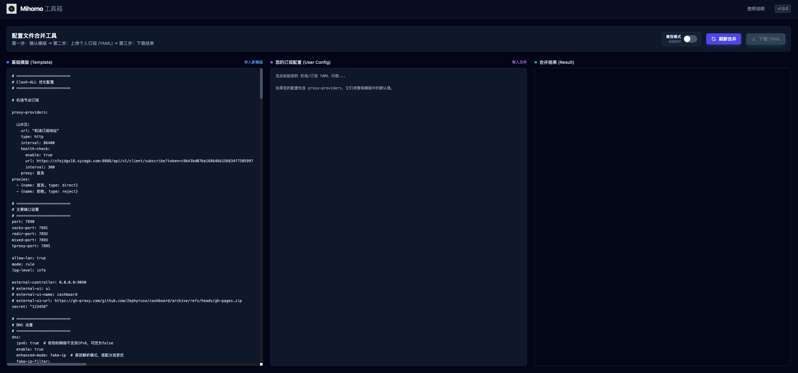

# YAML Config Merger Tool (YAML 配置合并工具)

**YAML Config Merger Tool** 是一个基于 Web 的纯前端工具，旨在帮助用户将个人的 Clash/Mihomo 机场订阅（节点信息）自动合并到预设的高级分流规则模版中。

它解决了“拥有好的规则模版，但每次更新订阅都需要手动复制粘贴节点”的痛点，并提供了独有的“兼容模式”，让不支持正则筛选的老旧内核也能使用高级分组逻辑。

## 1. 项目特点

- **隐私安全**：所有逻辑（解析、合并、生成）均在浏览器端（Client-side）执行，您的订阅信息**永远不会**发送到任何服务器。
- **极速合并**：基于 Angular Signals 和 JS-YAML，毫秒级响应。
- **智能兼容模式 (Polyfill)**：
  - **Smart 降级**：自动将 Mihomo 专属的 smart 策略组降级为通用的 url-test，防止老核心崩溃。
  - **前端正则预处理**：浏览器代替内核执行复杂的正则筛选（如 filter: "(?=.*(香港|HK)).*$"），生成静态的节点列表，确保在任何客户端（Clash Verge, Clash for Windows, ClashX）上都能完美运行。
- **注释保留**：智能重注机制，确保生成的 YAML 文件保留关键模块的中文注释，便于阅读。
- **现代化 UI**：使用 Tailwind CSS 构建的暗色系界面，简洁美观。



------


## 2. 技术架构

本项目是一个 **Zoneless Angular (v21+)** 应用，采用 **Standalone Components** 架构。

### 技术栈

- **框架**: Angular (Standalone, Signals)
- **样式**: Tailwind CSS (通过 CDN 引入)
- **核心库**: js-yaml (用于 YAML <-> JSON 转换)
- **构建工具**: 基于 Angular CLI 进行构建和开发，通过 `index.tsx` 引导应用。

### 构建与部署

本项目采用现代 Web 开发的最佳实践，支持多种部署方式：

- **开发模式**: 使用 Angular CLI 的即时编译功能，支持热重载
- **生产构建**: 可通过 Angular CLI 进行优化构建，生成静态文件
- **静态部署**: 构建后的文件可部署到任何静态文件服务器
- **容器化部署**: 支持 Docker 容器化部署

### 核心逻辑流程

1. **Input**: 用户输入“基础模版 YAML” + “个人订阅 YAML”。
2. **Parse**: 使用 js-yaml 将两者转换为 JSON 对象。
3. **Merge**:
   - 提取用户订阅中的 proxies (节点列表) 和 proxy-providers。
   - 将其合并到模版的 proxies 列表中。
4. **Process (兼容模式核心)**:
   - 遍历模版中的所有策略组 (proxy-groups)。
   - 检测 include-all: true 和 filter 正则表达式。
   - **在 JS 中执行正则**：用正则匹配所有节点名称，计算出该组应包含的节点。
   - **回填**：将匹配到的节点名称显式写入 proxies 数组。
   - **清理**：移除内核可能不支持的 include-all、filter、smart 等字段，生成静态配置。
5. **Dump**: 将合并后的对象转换回 YAML 字符串。
6. **Post-Process**: 重新插入中文注释头（因为 JSON 转换会丢失注释）。

------


## 3. 项目目录结构

codeText


```
.
├── index.html                  # 入口 HTML (引入 Tailwind, js-yaml, importmap)
├── index.tsx                   # Angular 启动文件 (Bootstrap)

├── shanshui.yaml               # (示例) 用户上传的订阅文件样例
├── clash-all-fallback-smart.yaml # (核心) 内置的高级分流模版
├── assets/                     # 存放图片等资源文件
│   └── Mihomo.png              # 应用界面预览图
├── public/                     # 存放公共资源文件
│   ├── favicon.ico             # 网站 favicon 图标
│   └── favicon.svg             # 网站 favicon 图标 (SVG格式)
└── src
    ├── app.component.html      # 主布局 HTML
    ├── app.component.ts        # 根组件逻辑
    ├── components
    │   └── config-merger.component.ts # 核心交互组件 (编辑器、按钮、UI逻辑)
    └── services
        └── yaml-processor.service.ts  # 核心业务逻辑 (解析、合并、正则Polyfill、降级处理)
```

### 目录结构说明

- **根目录**：包含主要的项目文件和配置文件
- **assets/**：存放应用内部使用的资源文件，如图片、字体等
- **public/**：存放需要直接对外提供访问的静态资源文件，如 favicon、robots.txt 等
- **src/**：存放应用的源代码
  - **components/**：存放 Angular 组件
  - **services/**：存放业务逻辑服务

------


## 4. 详细模块说明

### 4.1 src/services/yaml-processor.service.ts

这是项目的“大脑”。

- **parse()**: 安全地解析 YAML。
- **mergeConfigs()**: 执行合并逻辑。
  - 包含**兼容模式**的判断：如果开启，会在内存中运行正则，将动态规则转换为静态列表。
  - 包含**Smart 降级**：将 type: smart 转换为 type: url-test。
- **dump()**: 生成 YAML，并配置了自定义的键值排序（sortKeys），确保 port, dns, proxies 等关键配置在文件顶部。
- **addComments()**: 一个后处理函数，用于在生成的纯文本 YAML 中“找回”丢失的注释，增强可读性。

### 4.2 src/components/config-merger.component.ts

这是项目的“脸面”。

- **状态管理**: 使用 Angular signal 管理模版内容、用户内容、合并结果和兼容模式开关。
- **默认模版**: DEFAULT_TEMPLATE 常量中存储了经过精心设计的 clash-all-fallback-smart.yaml 内容。
- **文件处理**: 处理文件上传 (FileReader) 和文件下载 (Blob).
- **策略组顺序**: 逻辑中硬编码了默认策略组的顺序（如 default 组优先使用自动测速，default-direct 组优先使用直连）。

------


## 5. 使用指南

1. **打开应用**：浏览器访问部署地址。
2. **确认模版 (左侧)**：
   - 系统已内置了一份包含 DNS 优化、去广告、自动分流（香港/日本/美国等）的高级模版。
   - 如果您有自己的模版，可以点击“导入新模版”覆盖。
3. **上传订阅 (中间)**：
   - 找到您的机场订阅链接，在浏览器下载为 .yaml 文件，或直接复制文件内容。
   - 点击“导入文件”或直接粘贴到中间的文本框。
4. **选择模式 (右上角)**：
   - **兼容模式 (开启 - 推荐)**：生成的配置文件是“静态”的。Web 工具已经帮您把正则筛选算好了。**适用于所有内核** (Clash Premium, Clash Verge, ClashX, Mihomo)。
   - **原版模式 (关闭)**：生成的配置文件保留 include-all 和正则语法。**仅适用于最新的 Mihomo (Clash Meta) 内核**。
5. **生成与下载**：
   - 点击“刷新合并”查看预览。
   - 点击“下载 YAML”保存文件，然后导入您的 Clash 客户端即可。

------


## 6. 部署指南

由于这是一个纯静态的 Web 应用（无后端数据库），部署非常简单。以下是几种常见的部署方法：

### 方法 A: 使用 Vercel / Netlify (推荐)

这两种平台都提供免费的静态网站托管服务，非常适合部署此类应用。

#### 使用 Vercel 部署：
1. 将代码推送到 GitHub 仓库。
2. 访问 [Vercel官网](https://vercel.com/) 并使用 GitHub 账号登录。
3. 点击 "New Project"，选择您的仓库。
4. 保持默认设置，直接点击 "Deploy"。
5. 等待部署完成，您将获得一个公开访问的 URL。

#### 使用 Netlify 部署：
1. 将代码推送到 GitHub 仓库。
2. 访问 [Netlify官网](https://netlify.com/) 并使用 GitHub 账号登录。
3. 点击 "New site from Git"，选择您的仓库。
4. 保持默认设置，点击 "Deploy site"。
5. 等待部署完成，您将获得一个公开访问的 URL。

*提示*：这些平台会自动处理 HTTPS、CDN 和自定义域名配置，是快速部署的理想选择。

### 方法 B: 使用 Docker (Nginx)

如果您希望通过 Docker 容器化部署，可以使用以下步骤：

1. 首先构建项目（如果使用标准 Angular CLI 项目）：
   ```bash
   ng build --prod
   ```

2. 创建 Dockerfile 文件：
   ```dockerfile
   FROM nginx:alpine
   COPY ./dist/yaml-config-merger-tool /usr/share/nginx/html
   EXPOSE 80
   CMD ["nginx", "-g", "daemon off;"]
   ```

3. 构建并运行容器：
   ```bash
   docker build -t yaml-config-merger-tool .
   docker run -d -p 8080:80 yaml-config-merger-tool
   ```

4. 访问 `http://localhost:8080` 查看应用。

### 方法 C: 本地运行 (开发环境)

如果您想在本地运行此代码进行开发或测试，可以按照以下步骤操作：

1. 确保已安装 Node.js (推荐 LTS 版本)。
2. 安装 Angular CLI:
   ```bash
   npm install -g @angular/cli
   ```
3. 安装项目依赖:
   ```bash
   npm install
   ```
4. 启动开发服务器:
   ```bash
   npm run dev
   ```
5. 在浏览器中访问 `http://localhost:4200`。

### 方法 D: 静态文件部署

如果只需要部署静态文件，可以直接将项目文件上传到任何支持静态文件托管的服务（如 GitHub Pages、阿里云 OSS、腾讯云 COS 等）：

1. 构建项目（如果使用标准 Angular CLI 项目）：
   ```bash
   ng build --prod
   ```
2. 将 `dist/` 目录中的文件上传到您的托管服务。
3. 配置好域名和 SSL 证书（如果需要）。

*提示*：由于本项目使用了相对路径引用资源文件，确保在部署时保持正确的目录结构。

### 开发环境警告说明

在开发过程中，您可能会在浏览器控制台看到以下警告信息：

1. **redi 多次加载警告**：这是由于 Angular 开发环境中的依赖注入系统引起的，不影响功能，仅在开发环境出现。

2. **Tailwind CSS CDN 警告**：当前使用的是生产环境优化的 CDN 版本，包含明确的版本号和常用插件。在生产环境中，为了获得更好的性能和更小的文件体积，建议使用 PostCSS + Tailwind CLI 进行本地构建。

3. **Angular 开发模式警告**：这是正常的开发环境行为，表示应用正在开发模式下运行，具有额外的调试和验证功能。

这些警告在生产构建中会自动消失。

------


## 7. 常见问题 (FAQ)

**Q: 为什么生成的配置文件里没有 include-all 了？**
A: 如果您开启了“原版模式”，工具会把 include-all 的计算过程在浏览器里执行完毕，直接把结果（节点名称列表）写入了配置文件。这大大提高了配置文件的兼容性，防止旧版软件报错。如果您希望保留 include-all 语法，请使用“兼容模式”。

**Q: 我的机场只有 SSR 节点，支持吗？**
A: 支持。只要您的 Clash 核心支持该协议，本工具只是负责搬运和合并节点信息，不会修改节点本身的连接参数。

**Q: 为什么默认策略组不是“直连”？**
A: 为了更好的体验，我们将 Google, YouTube, Telegram 等国外服务的默认策略设为了 所有-智选（自动测速），这样您导入即用，无需手动切换。而 国内, Steam 等组默认设为了 直连 以节省流量。
